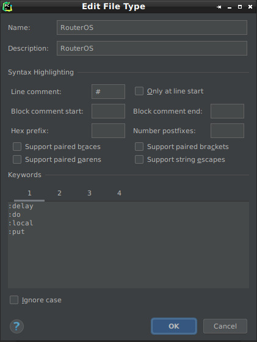
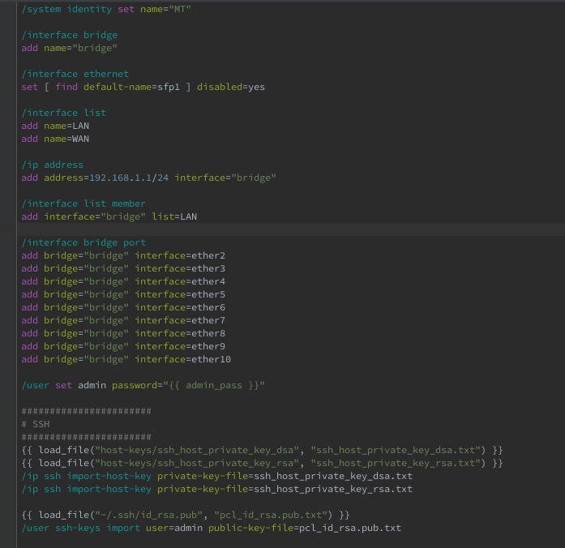

## Configuration dialog

## Keywords

* Tab 1 - [keywords-1.txt](keywords-1.txt)
* Tab 2 - [keywords-2.txt](keywords-2.txt)
* Tab 3 - [keywords-3.txt](keywords-3.txt)
* Tab 4 - [keywords-4.txt](keywords-4.txt)

## Highlighting example

